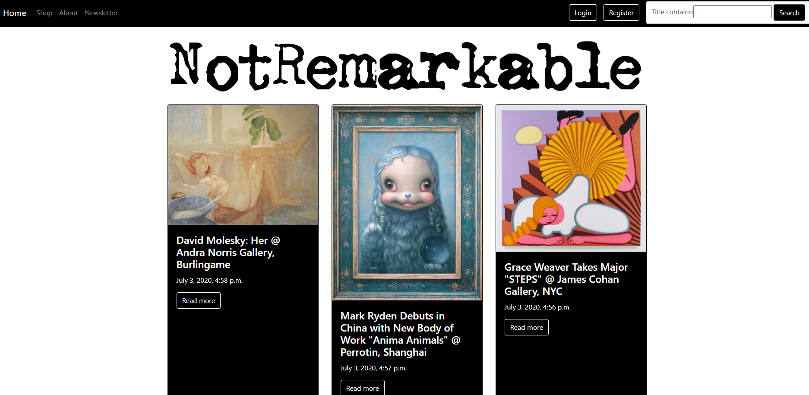

# NotRemarkable

Freelance project for an artist's personal website. There is a blog and a fully functional eCommerce aspect that allows users and guests to checkout through PayPal. The client has an email newletter that users and guests can subscribe to. The admin functionality includes the ability to post/edit/delete blog posts and products from the eCommerce store, as well as see all of the completed orders through the store.

